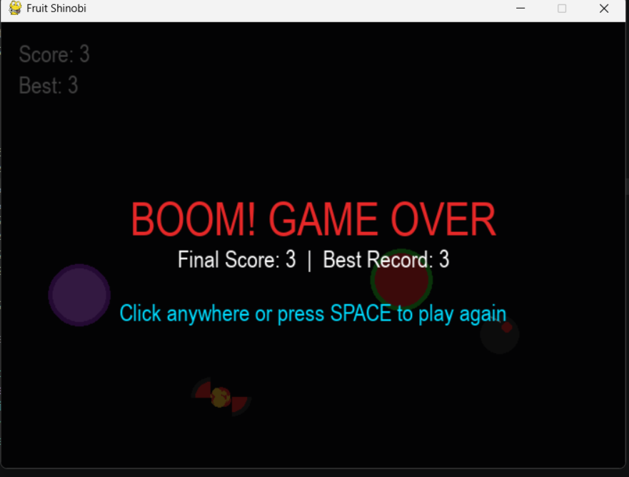
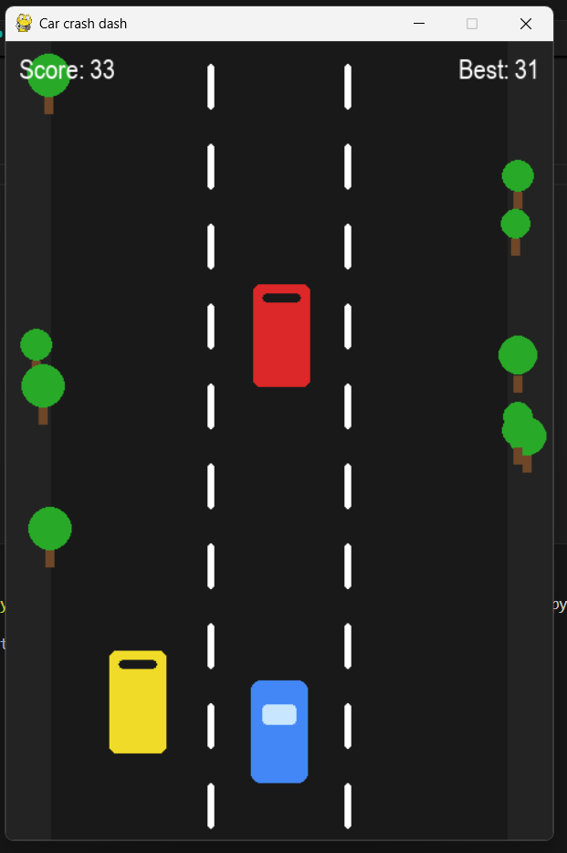
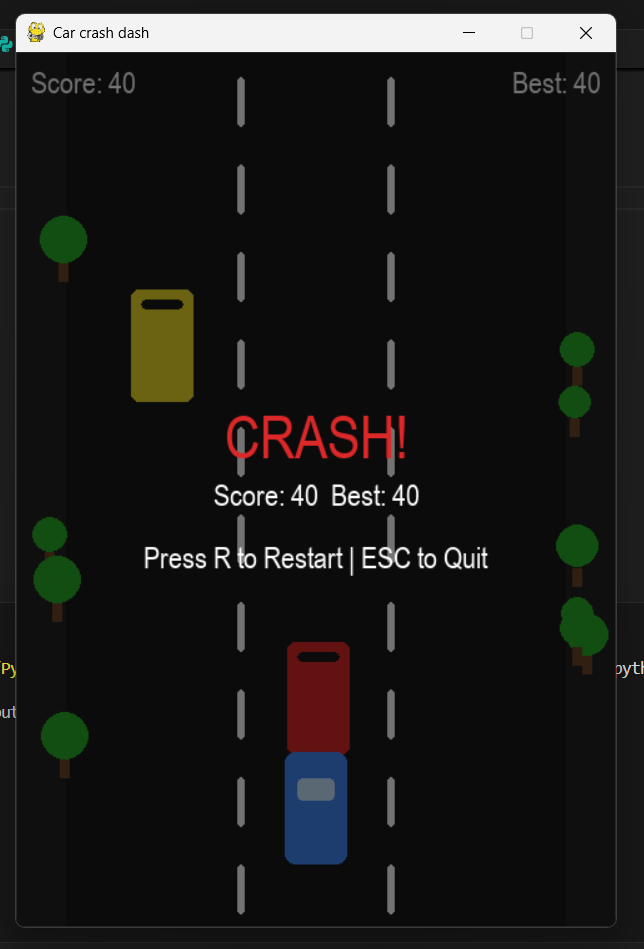
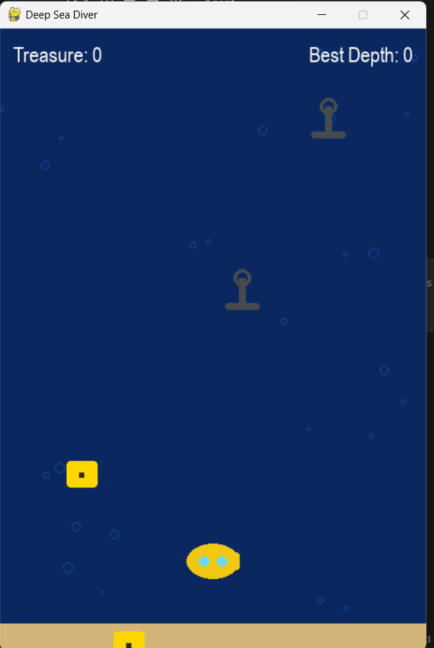

# python_project
# 🍎 Fruit Cutter

A simple fruit-cutting game built with Python and Pygame.

## 🎮 About the Project

Fruit Cutter is a simple game developed using Python and Pygame.
The player interacts with fruits and tries to achieve a high score.

## ✨ Features

- Fruit cutting gameplay
- Score tracking
- Game window and graphics
- Random fruit generation
- Basic game physics
- Sound effects

## 🛠️ Technologies Used

- Python
- Pygame

## 📸 Screenshot



## ▶️ How to Run

### 1. Install Python

Make sure Python is installed on your computer.

### 2. Install Pygame


pip install pygame

# 🚗 Car Crash Dash

A simple 2D car-dodging game built with Python and Pygame.

The player controls a car and tries to avoid incoming enemy cars while the game becomes progressively more difficult.

---

## 🎮 Game Screenshot





---

## 🎯 About The Game

In Car Crash Dash, the player controls a car on a three-lane road.

Enemy cars continuously appear from the top of the screen and move downward. The player must move between lanes and avoid collisions.

The game continues until the player's car crashes into an enemy car.

---

## ✨ Features

- 🚗 Player-controlled car
- 🛣️ Three-lane road
- 🚘 Randomly generated enemy cars
- 🌳 Moving roadside trees
- 💥 Collision detection
- 📊 Score system
- 🏆 High score tracking
- 📈 Increasing game difficulty
- 🔄 Restart option after crashing
- ⌨️ Keyboard controls
- 🖥️ Simple Pygame graphical interface

---

## 🎮 Controls

| Key | Action |
|-----|--------|
| `A` / `Left Arrow` | Move left |
| `D` / `Right Arrow` | Move right |
| `W` / `Up Arrow` | Move up |
| `S` / `Down Arrow` | Move down |
| `R` | Restart after crash |
| `ESC` | Quit the game |

---

## 🛠️ Technologies Used

- Python
- Pygame

---

## 📚 Python Concepts Used

This project helped me practice several Python programming concepts:

- Variables and data types
- Conditional statements
- Loops
- Functions
- Classes and objects
- Lists
- Random number generation
- Event handling
- Collision detection
- Basic game logic
- Object-oriented programming
- Pygame graphics
- Keyboard input
- Game loop
- Score calculation

---
## ▶️ How to Run

### 1. Install Python

Make sure Python is installed on your computer.

### 2. Install Pygame


pip install pygame

## 🌊 Deep Sea Diver

A simple 2D underwater game built with Python and Pygame.

In this game, the player controls a submarine and dives through the ocean while collecting treasure and avoiding falling anchors. The game becomes more challenging as the player's treasure score increases.

### 🎮 Game Screenshot



### ✨ Features

- 🚢 Player-controlled submarine
- 💰 Treasure collection system
- ⚓ Falling anchor obstacles
- 🫧 Animated underwater bubbles
- 🌊 Ocean-themed game environment
- 💥 Collision detection
- 📊 Treasure score system
- 🏆 High score tracking
- 📈 Increasing difficulty
- 🔄 Restart after game over
- ⌨️ Keyboard controls

### 🎮 Controls

| Key | Action |
|-----|--------|
| `A` / `Left Arrow` | Move submarine left |
| `D` / `Right Arrow` | Move submarine right |
| `R` | Restart after game over |
| `ESC` | Exit the game |

### 🛠️ Technologies Used

- Python
- Pygame

### 📚 Concepts Practiced

This project helped me practice:

- Variables and data types
- Conditional statements
- Loops
- Functions
- Classes and objects
- Lists
- Random number generation
- Object-oriented programming
- Keyboard event handling
- Collision detection
- Game loops
- Score management
- Difficulty progression
- Pygame graphics

### ⚙️ How to Run

Install Pygame:

```bash
pip install pygame
